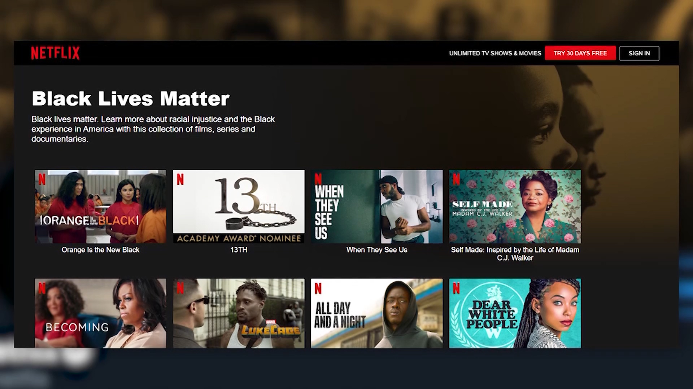

# DIGHUM 150A Archive Website: Social Issues - 2020

## Background
As 2020 has progressed, more social issues have come to public attention. With the surge of activism from the Black Lives Matter movement, people have been using this momentum to raise awareness to these many issues ranging from systemic racism within the United States to the horrors of the fast fashion industry. I want this website to serve as a compilation of many of these matters that have been brought up in 2020. Using social media posts, blogs, and news articles, I plan to organize some of the political and social issues that I have seen and want to share. This project was highly inspired by Instagram accounts such as [@soyouwanttotalkabout](https://www.instagram.com/soyouwanttotalkabout/?hl=en) and [@shityoushouldcareabout](https://www.instagram.com/shityoushouldcareabout/?hl=en).

## Timeline (plugin)
- This timeline plugin that allows me to portray which social issues became popular on which week(?).
- I want to add specific events that may have sparked the spread of awareness - e.g. COVID-19 becoming popular in the news caused people to speak about racism against Asians.

## Sample articles, images, etc.
- [Washington Post article about racism against Asian Americans](https://www.washingtonpost.com/business/2020/05/19/asian-american-discrimination/) - May 19, 2020
- [@soyouwanttotalkabout post about the Yemen crisis](https://www.instagram.com/p/CBl5g3-HxZD/) - June 18, 2020
- [TIME Magazine Model Minority article](https://time.com/5859206/anti-asian-racism-america/) - June 25, 2020

